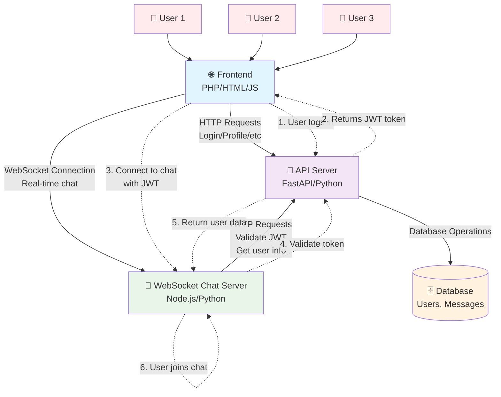

```mermaid
graph TB
    %% Users and Frontend
    U1[👤 User 1] --> FE[🌐 Frontend<br/>PHP/HTML/JS]
    U2[👤 User 2] --> FE
    U3[👤 User 3] --> FE
    
    %% Frontend connections
    FE -->|HTTP Requests<br/>Login/Profile/etc| API[🔧 API Server<br/>FastAPI/Python]
    FE -->|WebSocket Connection<br/>Real-time chat| WS[💬 WebSocket Chat Server<br/>Node.js/Python]
    
    %% Backend communication
    WS -->|HTTP Requests<br/>Validate JWT<br/>Get user info| API
    API -->|Database Operations| DB[(🗄️ Database<br/>Users, Messages)]
    
    %% Data flow annotations
    FE -.->|1. User logs in| API
    API -.->|2. Returns JWT token| FE
    FE -.->|3. Connect to chat<br/>with JWT| WS
    WS -.->|4. Validate token| API
    API -.->|5. Return user data| WS
    WS -.->|6. User joins chat| WS
    
    %% Styling
    classDef frontend fill:#e1f5fe
    classDef api fill:#f3e5f5
    classDef websocket fill:#e8f5e8
    classDef database fill:#fff3e0
    classDef user fill:#ffebee
    
    class FE frontend
    class API api
    class WS websocket
    class DB database
    class U1,U2,U3 user
```